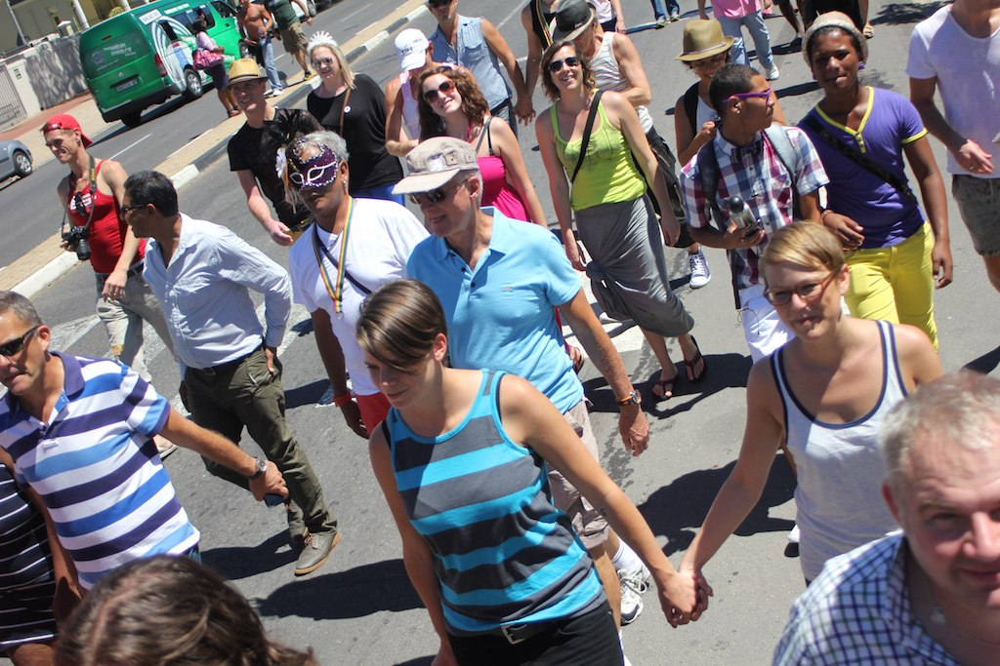
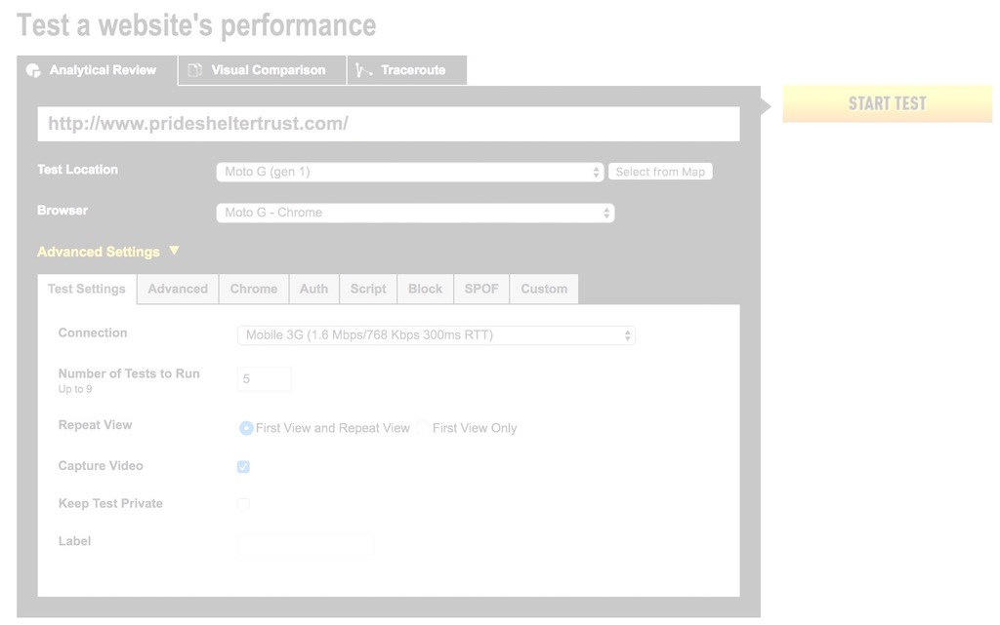

theme: fira, 1

# **CTFEDs**
# LGBT :rainbow:
# Hackathon

^ Don't unpack, you might be moving

---

## **Why are you here?**
## Write on a sticky :pencil:
## Tell 2 people

---

## **Agenda**

## Form teams
## Kanban board
## 1 of n: Benchmark

---

# Form teams

^ We want a mix of skills and experience

---

## **Experience**
## HTML, CSS, JS
## WordPress: Using, Editing, Making

^ Technical: Themes, Plugins

---

^ A thing that makes you go hmm
A thing that makes you go yay

---

## Put your sticky on a team

^ The PDF source: https://docs.google.com/document/d/1oi2orR6LCwdaDwcsvHo6fzfD4AOCyEesH06e_kQBPcA/edit?usp=sharing

---

# Kanban board

^ Who's familiar with?
Visualise the work, help focus

----

^ Why Options, not To Do? We probably won't have time to do all the things
Why small Doing column? **Limit WIP**: 1 one thing at a time for focus.

---

## **Benchmark**

## PageSpeed Insight
## WebAIM's WAVE
## WebPageTest

^ hand out benchmark printable

---

## Add **Benchmark stickies** to Doing 👉
## Put **your initials** in the corner

^ Pairing up is good

---

## **Constraints! 🙅**
## Don't change CMS
## Don't add complexity

^ Why? The most dangerous word in software: "just"
Don't add complexity for users: e.g. make it so they have to use Webpack, Grunt
As automatic as possible

---

## **Constraints! 🙅**
## Don't change content
## Don't change design

---

## Add stickies to **Options ✋**
## **Small** things
## **One thing** at a time

^ 1 hour at most. Break it into pieces.
Want to **finish** things, not start things
Just CSS or just JS, not both at the same time

---

# Go, go, go! :raised_hands:

^ Pick one sticky to work on.
Initials in the corner, move to Doing.
Move to Done, take a new sticky.
Repeat until awesome.

---

## **5m break**

## What's one thing you've learned so far?
## Tell 2 people

---

## **Shout outs**
## What change had the biggest effect?

^ 10m before end

---

# Next steps

^ ??? 🙀
