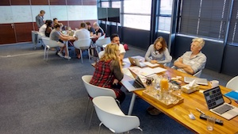

Rough outline for the day.

1. Short opening presentation from CTFEDs orgs.
2. Form teams.
3. Benchmark your site.
4. Get site running locally and / or on a staging environment.
5. Make a mini Kanban board for your team.
6. Go, go, go!
7. Just before the end of the hackathon, run the benchmarks again.
8. Closing: next steps.

## Opening

- Why are we doing this?
- What do we want to achieve today?
- Shape of the day.

## Form teams

Based on:

- site you want to work on;
- good mix of skills and experience in the team.

[Printable team sheets to put stickies on to](https://docs.google.com/document/d/1oi2orR6LCwdaDwcsvHo6fzfD4AOCyEesH06e_kQBPcA/edit?usp=sharing).

## Benchmark

Run the site through:

- [PageSpeed Insight](https://developers.google.com/speed/pagespeed/insights/).
- [WebAIM's WAVE](http://wave.webaim.org/).
- [WebPageTest](http://www.webpagetest.org/). Use the following settings (It should [look like this]({{ site.baseurl }}/img/webpagetest.jpg)).
    - Test Location: Moto G (Gen 1)
    - Browser: Moto G - Chrome
    - Advanced Settings:
        - Connection: Mobile 3G
        - Number of Tests to Run: 5
        - Repeat View: First View and Repeat View
        - Capture Video: true

**Note**: If you you're using the [WebPageTest API Wrapper for NodeJS](https://www.npmjs.com/package/webpagetest) and have an API key you can run `webpagetest test <url> --key $WPT_API_KEY --location "Dulles_MotoG" --connectivity "3G" --runs "5" --video` or `webpagetest test <url>  -k $WPT_API_KEY -l "Dulles_MotoG" -y "3G" -r "5" -v`.

[Printable Benchmark sheet](https://docs.google.com/document/d/1ZJc2UyCnmlcY1QZSAOAHbftAe3KUhRAB3sFYi0GI1B4/edit?usp=sharing).

## Mini Kanban

1. Grab a bit of A4 and make a Kanban board with the following columns. It should like a bit like [this example board]({{ site.baseurl }}/print/ExampleKanbanBoard.pdf): big first column and small second and third columns.
    - Options ✋ (Like To Do, but *not* a To Do list: we probably won't have time to do all the things)
    - Doing 👉 (Each person should only be working on one thing at a time.)
    - Done 👍 (Huzzah! Nice one :) )
2. Review the site and your benchmark data and write a bunch stickies for things that you could do.
3. Go, go, go!
    - Pick one sticky to work on.
    - Put your initials in the corner and move it to Doing.
    - When you're done, move it Done and take a new sticky.
    - Repeat until awesome.

---

## Photos

### Activities

Why are you here?

What's one thing you've learned so far?

### Action shots

 

---

Attendees must read and follow our [Code of Conduct](http://ctfeds.org/code-of-conduct/). Thanks! :)
